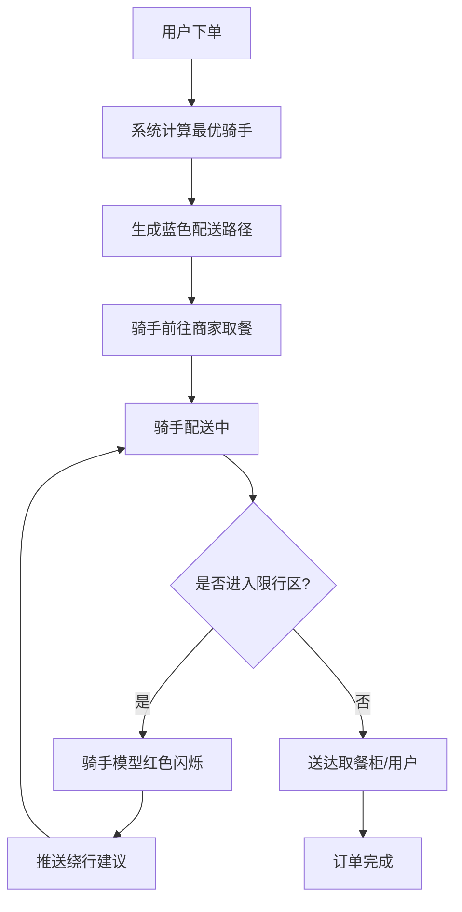
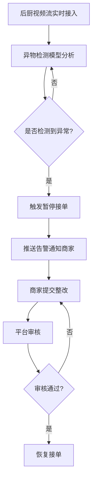
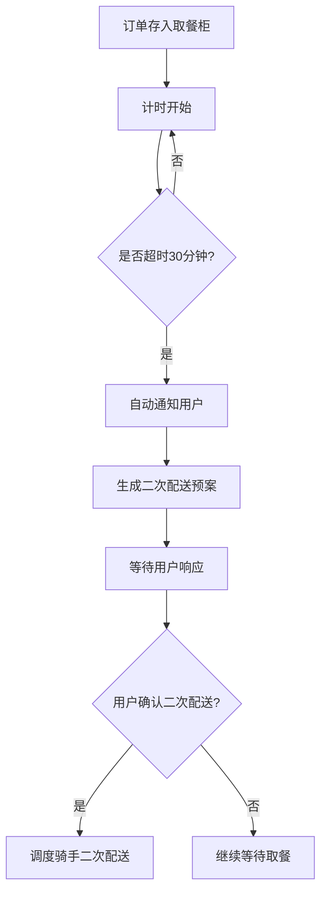

## 1. 产品概述

面向城市外卖配送的3D交互可视化调度与食品安全监管平台，通过3D城市模型实时展示商家、骑手、取餐柜和调度中心的运营状态，集成智能调度、路径规划、食品安全监管和数据分析功能，提升配送效率与食品安全管控能力。

- 核心目标：实现外卖配送全链路可视化调度，保障食品安全，提升运营效率
- 目标用户：平台管理员、商家运营人员、骑手管理团队
- 市场价值：解决外卖行业调度不透明、食品安全监管难、配送效率低等痛点

## 2. 核心功能

### 2.1 用户角色

| 角色 | 登录方式 | 核心权限 |
|------|----------|----------|
| 平台管理员 | 人脸识别登录 | 全局调度监控、食品安全审核、数据导出、用户管理、系统配置 |
| 商家 | 人脸识别登录 | 店铺信息管理、订单查看、后厨视频监控、食品安全整改 |
| 骑手 | 人脸识别登录 | 订单接单、配送路径导航、个人配送统计 |

### 2.2 功能模块

1. **3D可视化主界面**：城市3D场景、商家模型、骑手模型、取餐柜模型、调度中心
2. **商家管理模块**：店铺信息展示、销售曲线、食品安全评级、实时订单量
3. **骑手调度模块**：骑手实时位置、智能分配、配送路径、限行区域预警
4. **取餐柜模块**：格口状态、超时提醒、二次配送预案
5. **食品安全模块**：后厨视频流、异物检测、异常告警、暂停接单机制
6. **权限管理模块**：三级权限、人脸识别登录、操作日志
7. **数据统计模块**：配送统计、Excel导出、食品安全事件统计

### 2.3 页面详情

| 页面名称 | 模块名称 | 功能描述 |
|----------|----------|----------|
| 登录页 | 人脸识别登录 | 人脸摄像头采集、身份验证、登录日志记录 |
| 3D调度大屏 | 城市3D场景 | 全景3D地图、商家/骑手/取餐柜分布、实时数据刷新 |
| 3D调度大屏 | 商家详情面板 | 店铺名称、实时订单量、平均出餐时长、24小时销售曲线、食品安全评级 |
| 3D调度大屏 | 骑手详情面板 | 骑手信息、当前订单、配送路径、限行预警 |
| 3D调度大屏 | 取餐柜详情面板 | 格口列表、订单号、存放状态、超时提醒 |
| 商家后台 | 店铺管理 | 店铺信息编辑、订单管理 |
| 商家后台 | 后厨监控 | 实时视频流、异物检测告警、整改提交 |
| 平台管理 | 调度中心 | 全局监控、智能调度配置、异常处理 |
| 平台管理 | 食品安全审核 | 异常事件审核、商家整改审核、恢复接单 |
| 平台管理 | 数据导出 | 按日期导出Excel、订单量/送达时间/安全事件统计 |

## 3. 核心流程

### 3.1 订单配送流程

用户下单 → 系统自动分配最优骑手 → 生成蓝色配送路径 → 骑手前往商家取餐 → 骑手配送 → 送达取餐柜/用户 → 订单完成

### 3.2 食品安全监管流程

后厨视频流 → 异物检测模型分析 → 检测异常 → 触发暂停接单 → 商家整改 → 平台审核 → 恢复接单

### 3.3 取餐柜超时处理流程

订单存入取餐柜 → 计时开始 → 超时30分钟 → 通知用户 → 生成二次配送预案

## 4. 用户界面设计

### 4.1 设计风格

- **设计理念**：科技感未来主义（Tech Futurism），深色主题配合霓虹高亮，营造专业调度指挥中心氛围
- **主色调**：深空蓝 `#0a1628` 作为背景主色
- **强调色**：
  - 调度蓝 `#00d4ff` - 正常状态、配送路径
  - 警示红 `#ff4757` - 异常告警、限行区域
  - 安全绿 `#2ed573` - 正常状态、食品安全通过
  - 警告黄 `#ffa502` - 超时预警、待处理
- **字体**：
  - 标题：Orbitron（科技感等宽字体）
  - 正文：Inter（清晰易读的无衬线字体）
- **布局**：3D场景居中，四周悬浮数据面板，玻璃拟态风格
- **图标**：Lucide 线性图标，配合霓虹发光效果
- **动效**：
  - 数据面板入场：渐入 + 上滑
  - 告警闪烁：呼吸灯效果
  - 3D模型选中：光晕扩散
  - 路径绘制：线条流动动画

### 4.2 页面设计概述

| 页面名称 | 模块名称 | UI元素 |
|----------|----------|--------|
| 登录页 | 人脸识别区域 | 圆形摄像头取景框、扫描线动画、人脸识别状态指示、玻璃拟态登录卡片、背景粒子效果 |
| 3D调度大屏 | 顶部状态栏 | 系统时间、在线骑手可、今日订单数、食品安全事件数、用户头像下拉 |
| 3D调度大屏 | 左侧面板 - 商家列表 | 滚动列表、店铺名称标签、订单量徽标、食品安全等级色标 |
| 3D调度大屏 | 右侧面板 - 骑手状态 | 骑手卡片、配送中/空闲状态标签、位置距离 |
| 3D调度大屏 | 底部面板 - 告警信息 | 横向滚动告警条、红色闪烁告警项、处理按钮 |
| 3D调度大屏 | 中心3D场景 | 城市建筑模型、商家点标记、骑手移动模型、蓝色配送路径线、限行区域半透明红色区域 |
| 商家详情弹窗 | 销售曲线 | 24小时折线图、峰值标注、趋势指示 |
| 商家详情弹窗 | 食品安全评级 | 等级徽章、评分明细、最近检测记录 |
| 取餐柜详情 | 格口矩阵 | 网格布局、绿色占用/灰色空闲/黄色超时、订单号悬浮显示 |

### 4.3 响应式

- 桌面端优先设计，主屏幕支持1920×1080及以上分辨率
- 调度大屏为核心场景，适配指挥中心大屏展示
- 支持1280px宽度自适应，数据面板可折叠
- 平板端：3D场景自适应，面板改为底部抽屉式

### 4.4 3D场景指导

- **环境与氛围**：夜晚城市风格，深蓝色天空配合星星粒子，建筑窗户发光，营造科技感夜景
- **光照设置**：环境光 + 方向光模拟月光，建筑自发光材质，霓虹招牌发光效果
- **相机设置**：初始45度俯视角度，支持鼠标拖拽旋转、滚轮缩放、点击聚焦
- **场景组成**：
  - 地面：深色反光地面，网格线辅助
  - 建筑：简化几何体建筑，不同高度错落，窗户发光点
  - 商家模型：店铺图标 + 发光底座 + 信息悬浮牌
  - 骑手模型：小人模型 + 头顶状态指示 + 移动轨迹
  - 取餐柜模型：柜体模型 + 格口指示灯 + 状态浮窗
  - 配送路径：蓝色发光线条，流动动画效果
  - 限行区域：半透明红色立方体区域，边缘虚线动画
- **交互动效**：
  - 鼠标悬停：模型放大 + 光晕效果
  - 点击选中：底部光环扩散 + 详情面板滑入
  - 骑手移动：平滑位移动画，方向指示
  - 告警状态：红色闪烁 + 脉冲光环
- **后处理效果**：Bloom泛光、轻微辉光、雾效增强空间感
- **性能策略**：使用实例化渲染批量处理建筑模型，LOD层级细节，限制同时显示的模型数量
