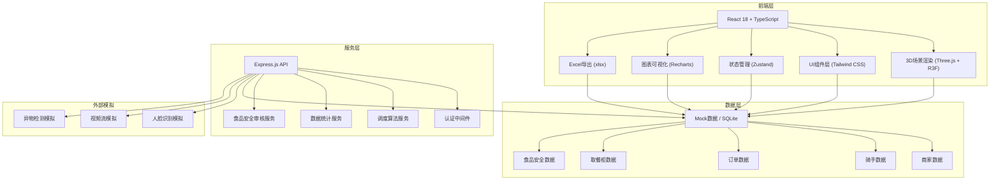
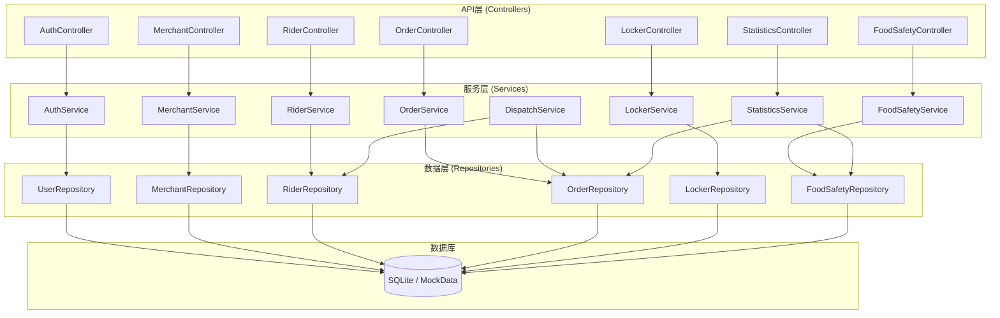
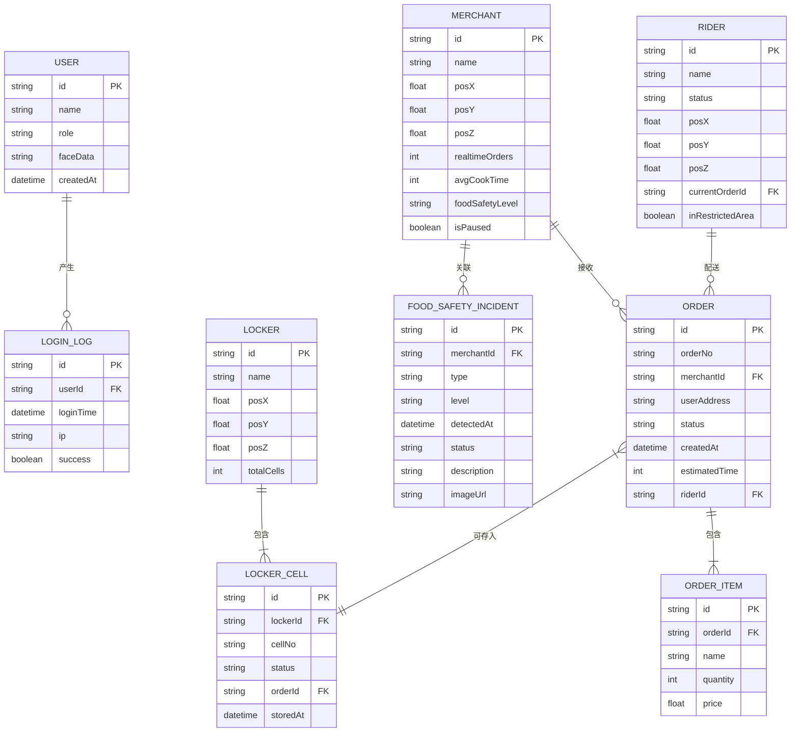

## 1. 架构设计



## 2. 技术描述

- **前端框架**：React 18 + TypeScript + Vite
- **UI框架**：Tailwind CSS 3
- **3D渲染**：three.js + @react-three/fiber + @react-three/drei + @react-three/postprocessing
- **状态管理**：zustand
- **图表库**：recharts
- **图标库**：lucide-react
- **Excel导出**：xlsx (SheetJS)
- **后端框架**：Express 4 + TypeScript
- **数据库**：Mock数据（前端），SQLite（后端可选）
- **初始化工具**：vite-init
- **项目模板**：react-express-ts

## 3. 路由定义

| 路由 | 页面名称 | 权限要求 | 说明 |
|------|----------|----------|------|
| /login | 登录页 | 公开 | 人脸识别登录 |
| /dashboard | 3D调度大屏 | 所有角色 | 3D可视化主界面，默认首页 |
| /merchant | 商家后台 | 商家/管理员 | 店铺管理、后厨监控 |
| /platform | 平台管理 | 管理员 | 调度中心、安全审核、数据导出 |
| /rider | 骑手端 | 骑手/管理员 | 骑手订单、配送导航 |

## 4. API定义

### 4.1 认证接口

```typescript
// 人脸识别登录
POST /api/auth/face-login
Request: { imageBase64: string }
Response: { 
  success: boolean, 
  user: { id: string, name: string, role: 'admin' | 'merchant' | 'rider' },
  token: string 
}

// 获取登录日志
GET /api/auth/login-logs
Response: { logs: Array<{ id: string, userId: string, userName: string, loginTime: string, ip: string }> }
```

### 4.2 商家接口

```typescript
// 获取商家列表
GET /api/merchants
Response: { merchants: Merchant[] }

// 获取商家详情
GET /api/merchants/:id
Response: { 
  merchant: Merchant,
  salesData: Array<{ hour: number, orders: number }>,
  foodSafetyRating: { level: 'A'|'B'|'C', score: number, lastCheck: string }
}

// 商家信息
interface Merchant {
  id: string
  name: string
  position: { x: number, y: number, z: number }
  realtimeOrders: number
  avgCookTime: number
  foodSafetyLevel: 'A' | 'B' | 'C'
  isPaused: boolean
}
```

### 4.3 骑手接口

```typescript
// 获取骑手列表
GET /api/riders
Response: { riders: Rider[] }

// 获取骑手位置（实时）
GET /api/riders/:id/location
Response: { id: string, position: { x: number, y: number, z: number }, status: 'idle'|'delivering' }

// 分配骑手
POST /api/orders/:orderId/assign-rider
Request: { riderId: string }
Response: { success: boolean, route: RoutePoint[] }

// 骑手信息
interface Rider {
  id: string
  name: string
  avatar: string
  status: 'idle' | 'delivering' | 'resting'
  position: { x: number, y: number, z: number }
  currentOrder?: string
  inRestrictedArea: boolean
}
```

### 4.4 订单接口

```typescript
// 创建订单
POST /api/orders
Request: { merchantId: string, userAddress: string, items: OrderItem[] }
Response: { order: Order, assignedRider: Rider, route: RoutePoint[] }

// 获取订单列表
GET /api/orders
Response: { orders: Order[] }

// 订单信息
interface Order {
  id: string
  orderNo: string
  merchantId: string
  merchantName: string
  userAddress: string
  status: 'pending' | 'cooking' | 'picking' | 'delivering' | 'delivered' | 'locker'
  createdAt: string
  estimatedTime: number
  riderId?: string
}
```

### 4.5 取餐柜接口

```typescript
// 获取取餐柜列表
GET /api/lockers
Response: { lockers: Locker[] }

// 获取取餐柜详情
GET /api/lockers/:id
Response: { locker: Locker, cells: LockerCell[] }

// 超时订单二次配送
POST /api/lockers/:lockerId/cells/:cellId/redeliver
Response: { success: boolean, newRider: Rider }

interface Locker {
  id: string
  name: string
  position: { x: number, y: number, z: number }
  totalCells: number
  availableCells: number
}

interface LockerCell {
  id: string
  cellNo: string
  status: 'empty' | 'occupied' | 'overtime'
  orderNo?: string
  storedAt?: string
  overtimeMinutes?: number
}
```

### 4.6 食品安全接口

```typescript
// 获取后厨视频流地址
GET /api/food-safety/merchants/:id/stream
Response: { streamUrl: string }

// 异物检测事件列表
GET /api/food-safety/incidents
Response: { incidents: FoodSafetyIncident[] }

// 暂停商家接单
POST /api/food-safety/merchants/:id/pause
Response: { success: boolean }

// 提交整改
POST /api/food-safety/incidents/:id/rectify
Request: { description: string, evidence: string[] }
Response: { success: boolean }

// 审核整改
POST /api/food-safety/incidents/:id/review
Request: { approved: boolean, comment?: string }
Response: { success: boolean }

interface FoodSafetyIncident {
  id: string
  merchantId: string
  merchantName: string
  type: 'foreign_object' | 'hygiene' | 'temperature'
  level: 'warning' | 'serious' | 'critical'
  detectedAt: string
  status: 'pending' | 'rectifying' | 'reviewing' | 'resolved'
  description: string
  imageUrl?: string
}
```

### 4.7 数据统计接口

```typescript
// 获取配送统计
GET /api/statistics/delivery
Query: { startDate: string, endDate: string }
Response: {
  totalOrders: number
  avgDeliveryTime: number
  onTimeRate: number
  foodSafetyIncidents: number
  dailyData: Array<{ date: string, orders: number, avgTime: number, incidents: number }>
}

// 导出Excel
GET /api/statistics/export
Query: { startDate: string, endDate: string }
Response: Excel文件流
```

## 5. 服务器架构图



## 6. 数据模型

### 6.1 数据模型定义



### 6.2 数据初始化

- 预置10个商家数据，分布在城市不同位置
- 预置20个骑手数据，初始随机分布
- 预置5个取餐柜数据
- 生成模拟实时订单数据
- 预置模拟食品安全事件数据
- 预置三个角色的测试用户账号
